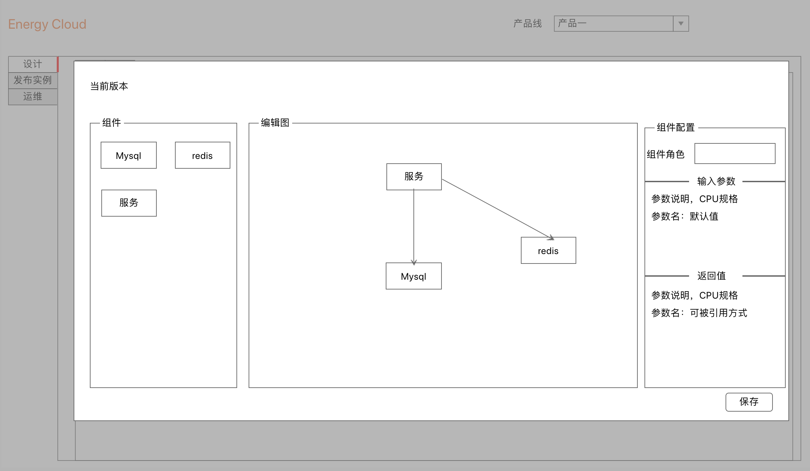
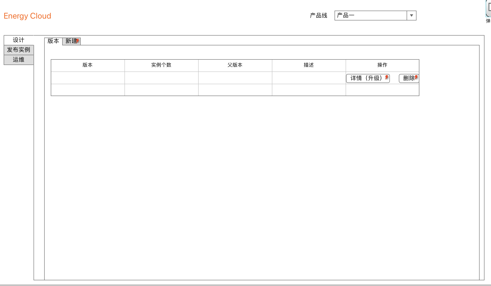
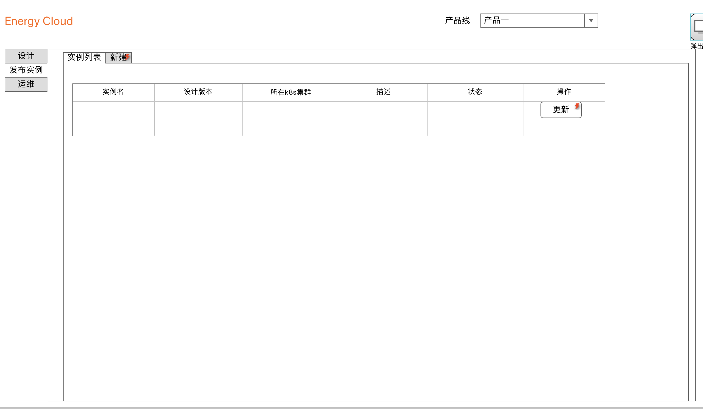

flight-deck是将组件经过编排组装成产品(这里指一整套系统)的服务.

### 流程
```
          中间件组件---------------|
                                  v
           业务模块------------>部署设计------------->部署实例
涉及人员:    (dev)                (ops)                 (ops)
```


### 概念
```
Component:基础组件：各种中间件，常用服务  
Design:产品设计
Instance:产品实例
Cluster:创建实例底层k8s集群
```

### 组织结构 
```
Product:
  ProductName: product
  Designs:
    - Revision: xxx           --------v
      CompnentRefers: 
        - Role: db            --------------|v|
          ComponentName: mysql
          Input: {USER:root,PASS:root}
          PreRoles: 
  Instances:
    - Name: test1
      KubeClusterName: test
      DesignRevision: xxxx    --------^
      CompnentObjs: 
        - Role: db            --------------|^|
          ComponentName: mysql
          Input: {USER:root,PASS:root}
          Output: 
```

#### 系统UI 

- 架构设计 


- 设计列表


- 部署实例


- 实例列表


### 中间件开发人员如何接入： 
[component定义](./components/README.md)  

### kubernetes引用  
```
productName---envrionmentName---instanceName---role
              |-k8s cluster-|               
  |-------------k8s namespace-------------|
  |-------------ComponentObject------------------|
```
